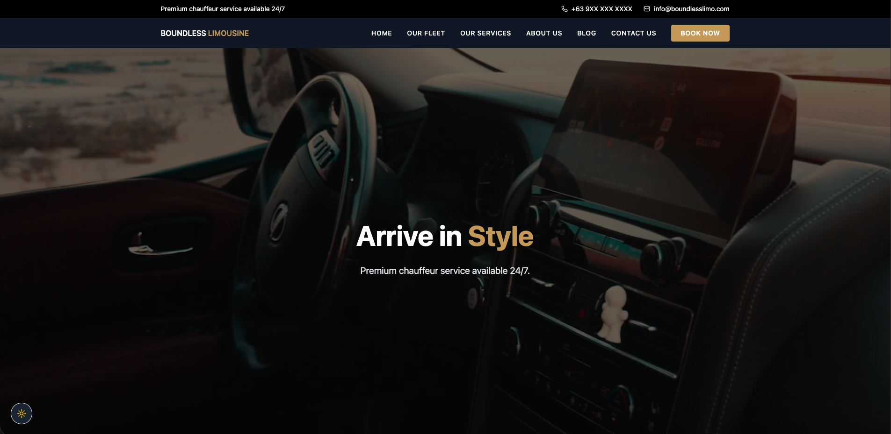
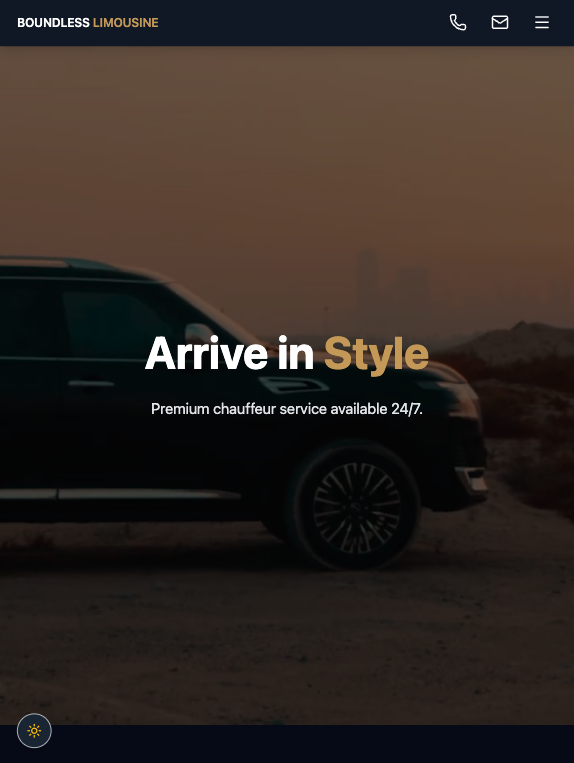
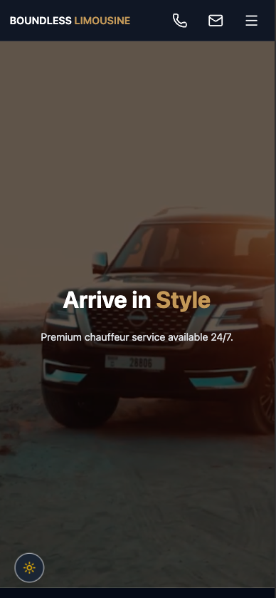

# 🚘 Web App Booking Management System





### 🚀 Live Demo

Vercel Deployment: 👉 https://booking-management-system-blue.vercel.app/

<br>

### ✅ Requirements Coverage

---

### 1️⃣ Match the sample Layout

- Pixel-aligned UI structure
- Sectioned booking flow (Trip → Contant → Passenger)
- Toggled for One-Way / Hourly
- Styled input components with icons
- Clean card-based layout

### 2️⃣ Fully Responsive

- Desktop (max-width container layout)
- Tablet (grid collapse properly)
- Mobile (stacked inputs, touch friendly)
- Tailwind responsive utilities used throughout

### 3️⃣ Input Validation

Client-side validation includes:

- Pickup address required
- Dropoff required (for one-way)
- Date & Time required
- Phone required
- First Name required
- Last Name required
- Email required
- Minimum 1 passenger.<br>

NOTE: Validation errors are displayed inline under each input forms / field.

### 4️⃣ Google Maps API integration

Implemented using:

- @react-google-maps/api
- Places Autocomplete
- DirectionService

Features:

- Address autocomplete for pickup and dropoff
- Airport mode support
- Distance calculation
- Estimated travel time calculation

Distance & duration update automatically when:

- Pickup and dropoff are both populated with destination

### 5️⃣ Phone Recognition Logic

Mock customer database implemented.

Behavior:

1. Try to enter this Philippine mobile number → `09171234567`
2. If phone `exists` inside the Mock customer data:<br>
   `Auto-fills First Name, Last Name, Email + Display greeting message`

`If phone not found:`

- User must manually enter contact details

This stimulates returning vs new customer behavior.

### 6️⃣ Basic Mock API Submission

Booking submission:

- validates form
- Sends booking data to mock async function
- Displays success message
- Resets entire form state (including route info)

---

### 🏗️ Architecture

Feature-based structure:

```
src/
└──features/
│   ├── booking/
│   │   ├── components/
│   │   ├── hooks/
│   │   ├── Booking Page.tsx
│   │   ├── services.ts
│   │   └── README.md
```

Separation of concers:

- UI components
- Business logic (hooks)
- API simulation (services)
- Routing isolated

---

### 🔐 API Key Security

- API key stored in environment variable
- Website restricted via Google Cloud Console
- Not hardcoded in repository

---

### ⚒️ How to Run Locally

```
Step #1 → git clone https://github.com/your-repo
Step #2 → cd booking-management-system
Step #3 → npm install
Step #4 → npm run dev
```

📕 Environment variable required:

```
VITE_GOOGLE_MAPS_API_KEY=your_api_key_here
```

---

### 🔥 Future Improvements

- Real backend integration
- Pricing calculation based on distance
- Auth-based booking history
- Admin dashboard
- Server-side validation
- Rate limiting for API calls

<br>
<br>

## 👀 Route Access Control

`The application implements route-level access control using React Router.`

### 🏪 Public Routes

- `/`
- `/fleet`
- `/services`
- `/booking`
- `/contact`

These routes are wrapped in `PublicLayout`.

### 🔎 Protected Routes

- `/dashboard`

Protected routes use:

- `ProtectedLayout`
- Role validation (`allowedRoles`)
- Auth state from `useAuth` hook

If the user is unauthorized, they are redirected.

<br>
<br>

## ✅ Tech Stack

### 🚪 Frontend

- React (TypeScript)
- Vite
- Tailwind CSS
- Google Maps API

### 📀 Backend

- Mock API
- Simulated database

### 🤳🏻 Future Backend Implementation

While this project currently uses a mock API layer (in-memory data simulation) as required by the technical test, it is structured to easilt support a real backend integration.

In a production environment, the following backend infra and architecture would be implemented:

### 🗄️ Database

- PostgreSQL (relational) or MongoDB (document-based)

- Proper schema for
  - Customer
  - Bookings
  - Vehicles
  - Pricing rules

### 🌐 Apil Layer

- REST API (Node.js/Express or Django REST Framework)
- Endpoints:
  - `POST /api/bookings`
  - `GET /api/customers/:phone`
  - `GET /api/pricing`

### 🚀 Deployment

- Backend deployed separately (e.g Railyway, Render, AWS, or DigitalOcean)
- Frontend connected via environment-based API URL
