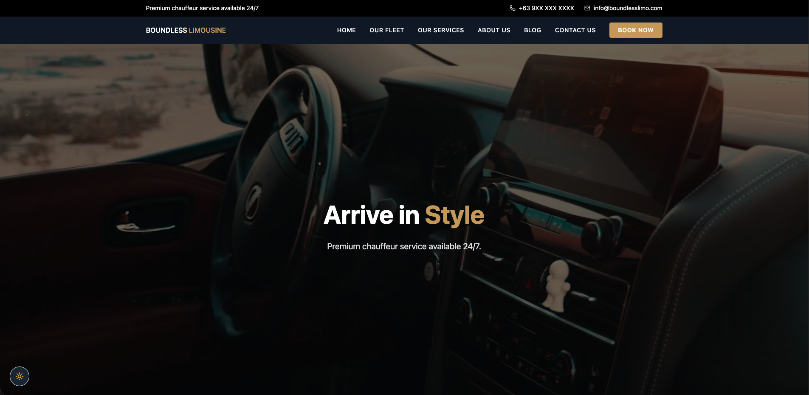
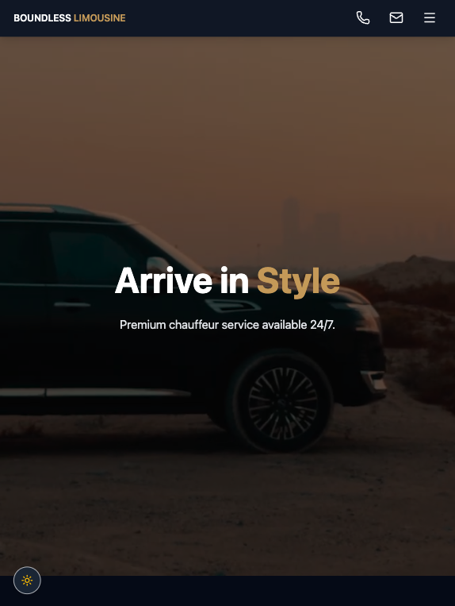
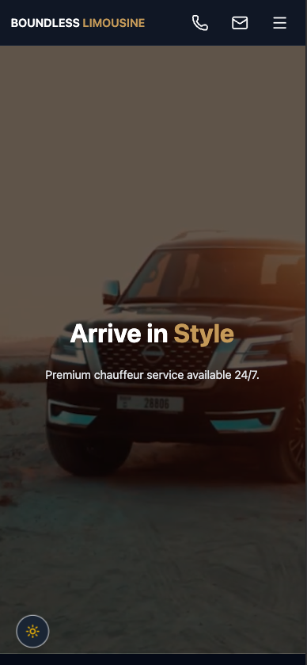

# 📱 → 🚘 Chauffeur Booking Management System
<em>React, TypeScript, Tailwind CSS, Google Maps API, Django REST Framework, PWA</em>

### Project Description
- Architected as **Progressive Web App** ─ single codebase delivering an installable,
  app-like experience across mobile, table, and desktop, eliminating the cost of separate
  native apps for a premium chauffeur service.
- Achieved 90+ Lighthouse PWA score with optimized asset chaching, offline fallback,
  and sub-3s load time on mobile networks.
- Built a responsive customer booking portal with sectioned booking flow (trip → contact → passenger),
  inline validation, and one-way / hourly trip modes.
- Integrated Google Maps Places Autocomplete and Directions for real-time address lookup,
  distance, and travel-time estimation
- Implemented returning-customer recognition via phone lookup with automated profile autofill
- Designed Django REST Framework backend with structured database models for booking workflows
  and trip status tracking (Pending, Confirmed, Completed, Cancelled)
- Deployed frontend on Vercel and backend on Render with environment-based configuration

### Responsive View

| Desktop      | Tablet | Mobile |
| ----------- | ----------- | ----------- |
|     |  |  |

### 🚀 Live Demo

Vercel Deployment: 👉 https://booking-management-system-blue.vercel.app/

